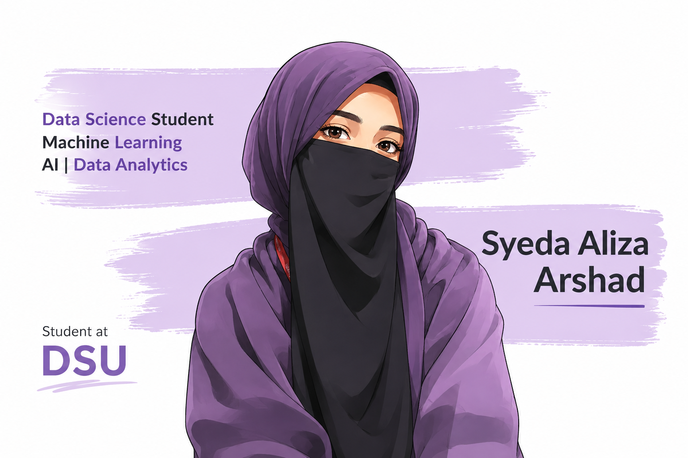

  

# Hi, I'm Syeda Aliza Arshad 👋

### Data Science Student | AI & Machine Learning | Data Analytics

I'm a **Data Science student** with a strong interest in **Artificial Intelligence, Machine Learning, Data Analytics, and Cybersecurity**. I enjoy turning data and ideas into practical solutions that solve real-world problems.

My work focuses on **data analysis, machine learning, intelligent applications, and data visualization**, while continuously developing my skills through hands-on projects and experimentation.

---

## 👩🏻‍💻 About Me

🎓 **Data Science Student**
📊 Interested in **Data Science & Analytics**
🤖 Exploring **Machine Learning & Artificial Intelligence**
🛡️ Interested in **Cybersecurity & Intelligent Threat Detection**
💻 Building practical projects with **Python and modern development tools**
🌱 Always learning, experimenting, and improving

I believe the best way to learn technology is by **building things**, which is why I focus on hands-on projects and real-world applications.

---

## 🛠️ Technical Skills

### Languages

### Data Science & Machine Learning

### Visualization

### Web & Development

### Tools

---

## 🚀 Featured Project

### 🧕 Haya & Co

**E-Commerce Hijab Store & Digital Shopping Experience**

Haya & Co is a **premium hijab-focused e-commerce concept** designed to provide a simple, elegant, and user-friendly online shopping experience.

The project focuses on building a complete digital storefront, from product presentation and customer experience to intelligent assistance through an integrated chatbot.

**Key Features**

* 🧕 Premium hijab and stoler collections
* 🛍️ E-commerce storefront
* 💬 AI-powered customer support chatbot
* 🔎 Product and shopping assistance
* 📦 Customer-focused shopping experience
* 🎨 Clean and modern interface
* 📱 Responsive web experience

**Technologies & Areas:**
`HTML` `CSS` `JavaScript` `E-Commerce` `Chatbot` `AI`

---

## 📊 What I Work On

### Data Science

Working with datasets to clean, analyze, visualize, and extract meaningful insights.

### Machine Learning

Building and evaluating machine learning models for classification and prediction problems.

### Artificial Intelligence

Exploring practical applications of AI, including intelligent assistants and AI-powered systems.

### Cybersecurity

Applying data science and machine learning techniques to network monitoring and threat detection.

### Software Development

Turning data and machine learning concepts into usable applications through APIs, dashboards, and backend systems.

---

## 📚 Currently Learning

* Advanced Machine Learning
* Artificial Intelligence
* Data Engineering
* Model Deployment
* Cybersecurity & Threat Detection
* AI-powered Applications
* Building scalable data-driven systems

---

## 🎯 My Focus

I'm working toward becoming a **strong Data Science and AI professional** by combining analytical thinking with practical software development.

My goal is to build solutions that are not only technically sound, but also **useful, understandable, and capable of solving real-world problems**.

---

## 💡 Beyond the Code

I enjoy learning new technologies, exploring ideas, collaborating on projects, and continuously improving through hands-on experience.

For me, every project is an opportunity to learn something new and turn that knowledge into something useful.

---

## 🤝 Let's Connect

I'm open to **collaboration, interesting projects, learning opportunities, and conversations around Data Science, AI, Machine Learning, and Cybersecurity**.

 
 

### Thanks for visiting my profile!
